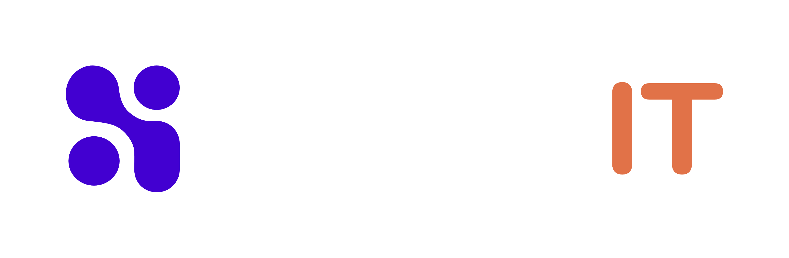

<div align="center">
  
</div>

# 🚀 SkemaIT - Plataforma Web Oficial

Bienvenido al repositorio oficial de **SkemaIT** ([skemait.com](https://skemait.com)). Este proyecto es una plataforma web moderna, interactiva y de alto rendimiento diseñada para exhibir sistemas de crecimiento, experiencias 3D/WebGL inmersivas, desarrollo de software a medida e ingeniería de transformación digital.

---

## 📌 Tabla de Contenidos

- [✨ Stack Tecnológico](#-stack-tecnológico)
- [📁 Estructura del Proyecto](#-estructura-del-proyecto)
- [💻 Requisitos Previos e Instalación](#-requisitos-previos-e-instalación)
- [🛠️ Comandos Disponibles](#️-comandos-disponibles)
- [🤝 Guía de Contribución y Reglas del Repositorio](#-guía-de-contribución-y-reglas-del-repositorio)
- [📝 Plantilla y Convención de Commits](#-plantilla-y-convención-de-commits)
- [🚀 Despliegue a Producción](#-despliegue-a-producción)

---

## ✨ Stack Tecnológico

- **Framework Principal:** [Astro 7](https://astro.build/) (Static Site Generation / SSR)
- **UI & Componentes:** [React 19](https://react.dev/), [shadcn/ui](https://ui.shadcn.com/), Lucide Icons
- **Estilos:** [Tailwind CSS v4](https://tailwindcss.com/)
- **Gráficos & Experiencias 3D/WebGL:** Three.js, LiquidEther Canvas, Spline, UnicornStudio React
- **Gestor de Paquetes:** [pnpm](https://pnpm.io/)
- **Entorno de Ejecución:** Node.js (>= 22.12.0)

---

## 📁 Estructura del Proyecto

```text
skemait/
├── public/                  # Archivos estáticos (imágenes, fuentes, favicons)
├── src/
│   ├── assets/              # Recursos gráficos del proyecto (logos, vectores)
│   ├── components/
│   │   ├── 3D/              # Componentes de renderizado 3D (Spline, Three.js)
│   │   ├── Common/          # Componentes reutilizables (Navbar, Footer)
│   │   ├── Sections/        # Secciones principales de la web:
│   │   │   ├── Hero/        # HeroSection.astro
│   │   │   ├── Services/    # ServicesSection.astro
│   │   │   ├── Testimonials/# TestimonialsSection.astro
│   │   │   └── About/       # AboutSection.astro
│   │   └── ui/              # Componentes de UI atómicos (Botones, etc.)
│   ├── layouts/
│   │   └── Layout.astro     # Plantilla base HTML5, cabeceras y envolvente global
│   ├── pages/
│   │   └── index.astro      # Página principal (Homepage "/")
│   └── styles/
│       └── global.css       # Variables de tema, fuentes y Tailwind CSS v4
├── astro.config.mjs         # Configuración del framework Astro e integraciones
├── package.json             # Dependencias del proyecto y scripts
└── README.md                # Documentación principal del repositorio
```

---

## 💻 Requisitos Previos e Instalación

### Requisitos:

- **Node.js:** Versión `>= 22.12.0`
- **pnpm:** Versión `>= 9.0.0` (`npm i -g pnpm`)

### Pasos para la instalación local:

1. **Clonar el repositorio:**

   ```bash
   git clone https://github.com/tu-usuario-o-organizacion/skemait.git
   cd skemait
   ```

2. **Instalar dependencias:**

   ```bash
   pnpm install
   ```

3. **Iniciar el servidor de desarrollo local:**
   ```bash
   pnpm dev
   ```
   Abre [http://localhost:4321](http://localhost:4321) en tu navegador para ver la aplicación en vivo.

---

## 🛠️ Comandos Disponibles

| Comando                 | Descripción                                                                |
| :---------------------- | :------------------------------------------------------------------------- |
| `pnpm dev`              | Inicia el servidor de desarrollo local en `http://localhost:4321`          |
| `pnpm build`            | Compila el sitio optimizado para producción en el directorio `./dist/`     |
| `pnpm preview`          | Sirve localmente la build de producción para pruebas previas               |
| `pnpm exec astro check` | Ejecuta la verificación de tipos TypeScript y validación de sintaxis Astro |

---

## 🔐 Seguridad — Variables de entorno (`.env`)

> ⚠️ **NUNCA publiques `.env`** — contiene `RESEND_API_KEY` y `GOOGLE_SERVICE_ACCOUNT_JSON`.
> Si lo necesitas, **pídemelo a mí (@jgelv)** por canal privado. Ver guía completa en [`docs/ENV_SECURITY.md`](docs/ENV_SECURITY.md) y plantilla `.env.example`.

## 🤝 Guía de Contribución y Reglas del Repositorio

> ⚠️ **RESTRICCIÓN IMPORTANTE DE SEGURIDAD Y CALIDAD:**  
> **Está prohibido hacer push directo a la rama `main`.**  
> Todo cambio debe integrarse mediante un **Pull Request (PR)**. El merge a `main` está bloqueado hasta que **un colaborador oficial del proyecto revise y apruebe los cambios**.

### Flujo paso a paso para hacer cambios:

1. **Sincronizar la rama `main` local:**

   ```bash
   git checkout main
   git pull origin main
   ```

2. **Crear una rama secundaria de trabajo:**
   Usa un prefijo descriptivo (`feature/`, `fix/`, `docs/`, `refactor/`):

   ```bash
   git checkout -b feature/nueva-seccion-contacto
   ```

3. **Realizar los cambios y validar localmente:**
   Antes de confirmar tus cambios, asegúrate de que el código no contenga errores:

   ```bash
   pnpm exec astro check
   pnpm build
   ```

4. **Hacer commit siguiendo la convención:**
   _(Consulta la plantilla en la siguiente sección)_.

   ```bash
   git add .
   git commit -m "feat(contacto): agregar formulario interactivo de cotizacion"
   ```

5. **Subir la rama al repositorio remoto:**

   ```bash
   git push origin feature/nueva-seccion-contacto
   ```

6. **Crear el Pull Request (PR):**
   - Ve a GitHub y abre un Pull Request desde tu rama hacia `main`.
   - Describe los cambios realizados y adjunta capturas de pantalla si modificaste la interfaz.
   - Solicita la revisión a un **colaborador del proyecto**.
   - Una vez aprobado el PR y superadas las comprobaciones automáticas, el colaborador realizará el **Merge**.

---

## 📝 Convención de Commits

Todos los commits deben seguir la convención **Conventional Commits** para mantener un historial legible, rastreable y profesional.

---

### 📋 Plantilla de Commit

```text
══════════════════════════════════════════════════════
  PLANTILLA DE COMMIT — SkemaIT
══════════════════════════════════════════════════════

<tipo>(<componente>): <descripción corta — máx. 72 caracteres>

──────────────────────────────────────────────────────
¿POR QUÉ se hace este cambio? (recomendado)
──────────────────────────────────────────────────────
[Explica la motivación, el problema que resuelve o el contexto necesario]

──────────────────────────────────────────────────────
REFERENCIAS (opcional)
──────────────────────────────────────────────────────
Closes #<número-de-issue>
Relacionado con: #<otro-issue>

══════════════════════════════════════════════════════
TIPOS VÁLIDOS:
  feat     → Nueva funcionalidad
  fix      → Corrección de bug
  style    → Cambios visuales o de formato (CSS, espaciado)
  refactor → Reestructuración de código sin cambio de lógica
  docs     → Cambios en documentación o comentarios
  perf     → Mejoras de rendimiento o velocidad de carga
  chore    → Mantenimiento, actualización de paquetes, configs
  test     → Añadir o corregir pruebas

COMPONENTES COMUNES:
  navbar · footer · hero · services · testimonials
  about · layout · index · global.css · spline · 3D
══════════════════════════════════════════════════════
```

---

### ✅ Reglas del Encabezado

- **Máximo 72 caracteres** en la primera línea
- **Minúsculas** en la descripción (nunca mayúsculas)
- **Modo imperativo** — escribe lo que hace el commit, no lo que hiciste  
  ✅ `agregar animacion al navbar`  
  ❌ `agregué animación al navbar`
- **Sin punto final** en el encabezado

---

### 📌 Ejemplos Reales

```bash
# Nueva funcionalidad
feat(hero): agregar fondo interactivo LiquidEther con soporte para mouse

# Corrección de bug
fix(spline): corregir ruta de importacion del modulo next para compatibilidad Astro

# Cambio visual
style(navbar): añadir animacion de subrayado con reveal en hover

# Refactorización
refactor(about): simplificar estructura de grilla asimetrica

# Documentación
docs(readme): agregar plantilla de commits y guia de contribucion

# Mantenimiento
chore(deps): actualizar @splinetool/react-spline a version 4.1.0
```

---

## 🚀 Despliegue a Producción

1. **Integración Continua (CI/CD):**  
   El proceso de despliegue a producción se ejecuta automáticamente de forma integrada cuando una rama es **aprobada por un colaborador** y fusionada (_merged_) en la rama `main`.

2. **Compilado de Producción:**  
   El entorno de producción ejecuta automáticamente:

   ```bash
   pnpm build
   ```

   Generando los archivos estáticos optimizados en el directorio `dist/` para ser servidos con máximo rendimiento global.

3. **Prueba local previa a producción:**  
   Puedes simular la compilación final en tu equipo ejecutando:
   ```bash
   pnpm build
   pnpm preview
   ```
